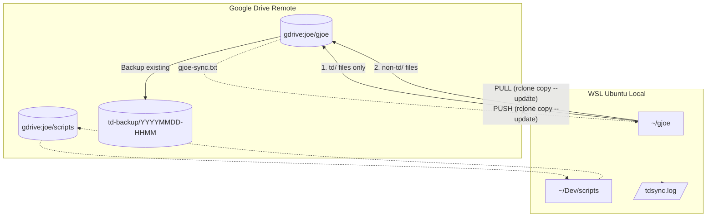

# tdsync Bidirectional Flow Diagram

This diagram visualizes the bidirectional synchronization logic implemented in `~/Dev/scripts/tdsync`.

### Key Logic
- **Safety:** GDrive `td/` files are backed up to a timestamped folder before any overwrite.
- **Filtering:** Uses three distinct filters (`gjoe-sync.txt`, `td-only.txt`, `gjoe-no-td.txt`) to manage complex sync rules.
- **Concurrency:** Pulls and Pushes are executed in parallel using background processes and `wait`.
- **Logs:** All activity is appended to `~/gjoe/tdsync.log`.
